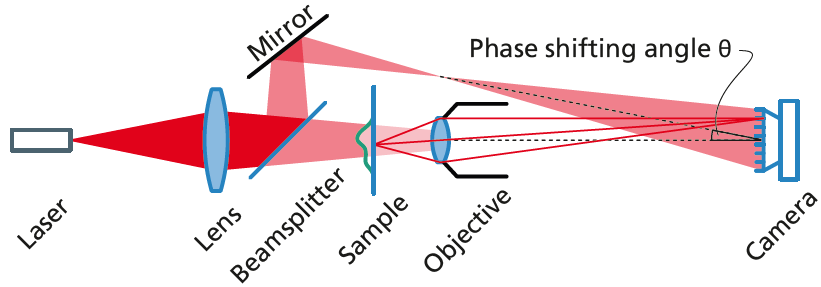

Start by putting everything at the positions given in [reference_assembly.py](../reference_assembly.py).
If you are using the recommended parts, that should be a very good starting position.

There are no thin, collimated beams anywhere in the setup. 
Remove the collimating lens from you laser, if there is one.
The beams in the sketch are not to scale, but give a good idea of what is going on.

The diverging beam from the laser may be larger than the condensor lens.
There is ample laser power, so we can waste some light here. 
Usually, the laser diode will not emit a round beam, but a highly elliptical one.
In its smaller dimension, the beam should fill the entire condensor lens.

Passing the sample, the beam has about 1 cm diameter.
It should fill the entire aperture of the objective, focussing at a point somewhere inside the objective.
At the camera, the "beam" will be much larger than the camera chip.

Move the sample (or the lens) until it is in focus.
It can be helpful to use the fast `raspistill -f` for this, instead of getting only a few frames per second in our gui.

The beamsplitter should have its coated side facing the laser. 
As in the sketch, the reference beam should have a focus approximately next to the objective.
To change where this focus is, move the laser.
Adjust the mirror so that the reference beam illuminates the entire camera chip.
It's ok if parts of the reference beam hit the sample or objective holder, as long as the camera chip is fully lit.

Block the reference beam to focus or to find your way around the sample.
It will be brighter than the object beam, making the object hard to see.
This is perfectly fine for interferometry, even if that may not be intuitive.

Now, using the holmos software, the FFT should have a bright point in the center,
 and two symmetrically spaced points near the edges.
Those points are due to interference of object and reference beam, and correspond to the +-1st diffraction orders: 
If you cover the reference beam, the two points should disappear.
As soon as a sample is in the object beam, the points should be surrounded by elliptical discs.
The software shows a rectangle with a center spot: the disc's diameters should match the rectangle's size.
  